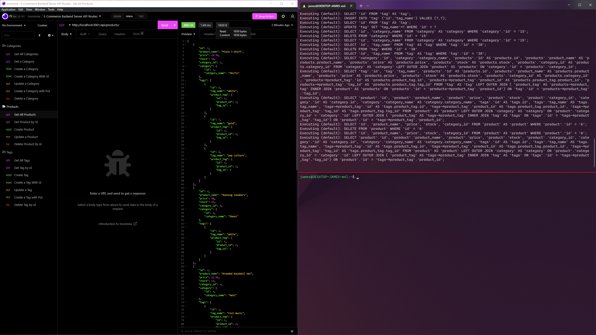
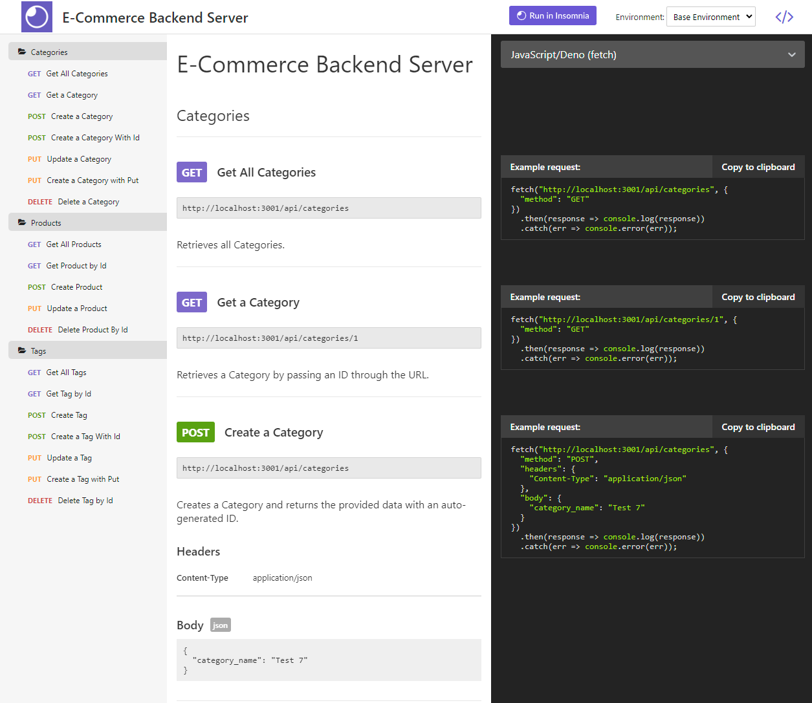
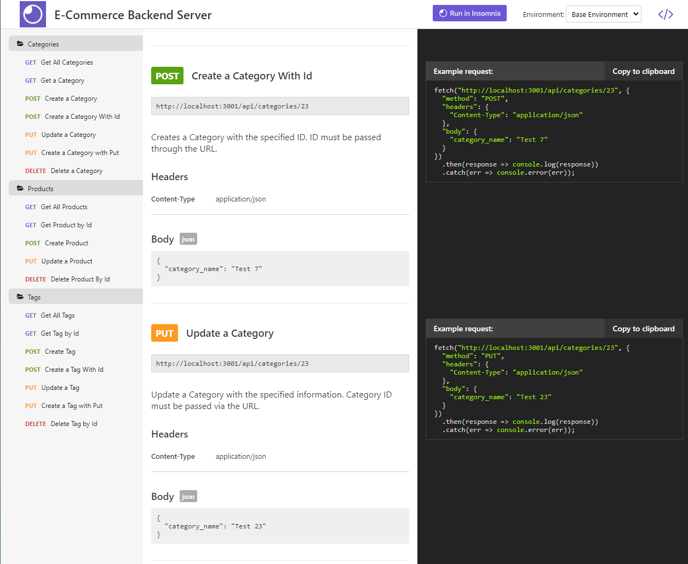
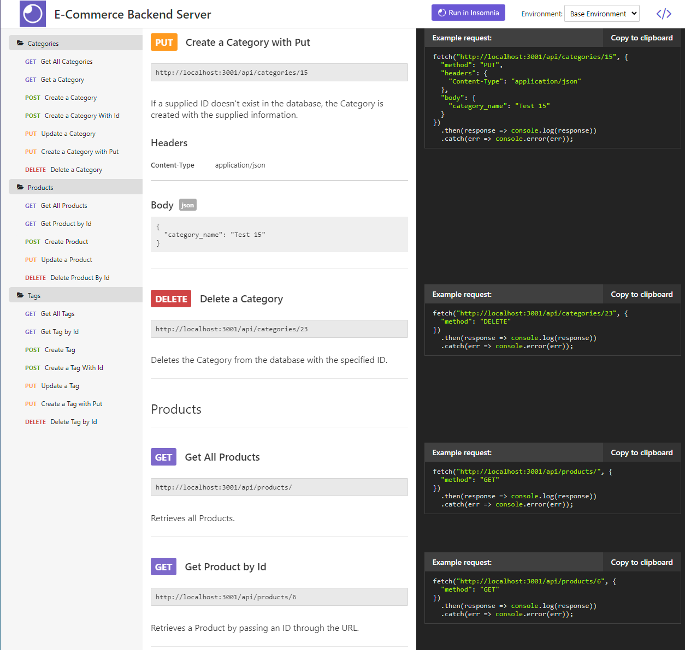
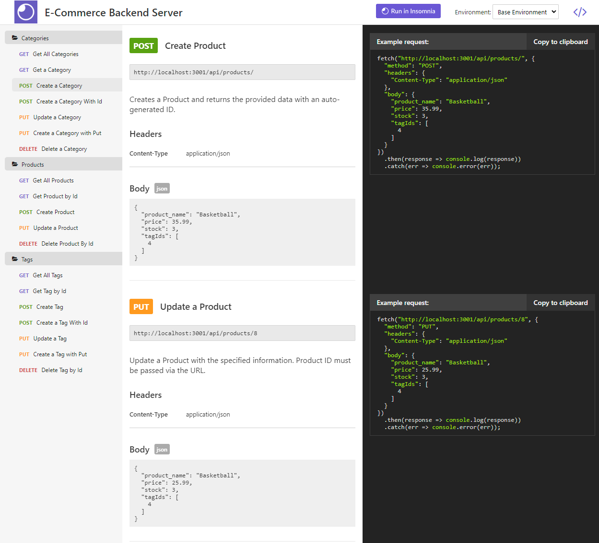
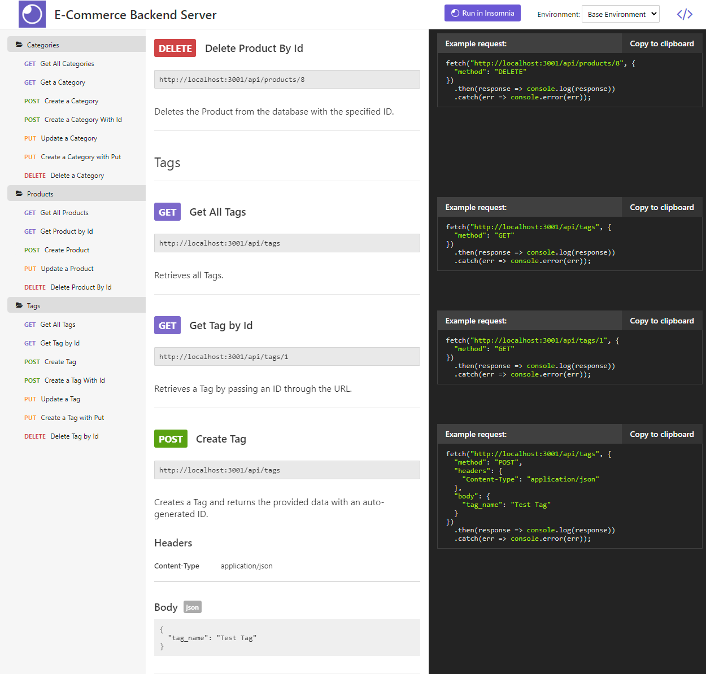
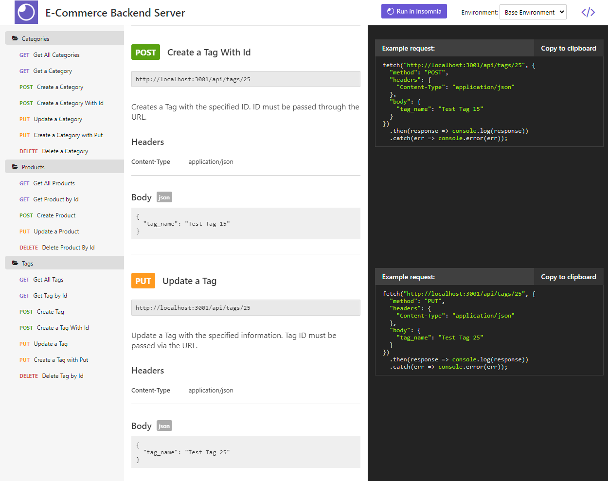
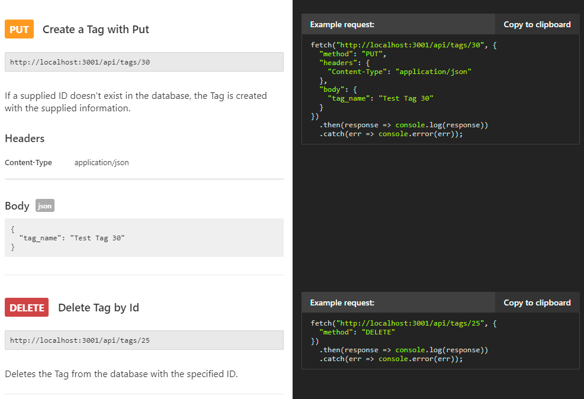

# E-commerce Backend Server

## Description

Small scale backend server for e-commerce using express and sequelize to provide the backend interaction for API requests. The database contains tables for categories, products, tags, and a product_tag. The product_tag table is used to associate products and tags with each other since both models can contain multiples of each other. Sequelize made interacting with the database significantly trivial compared to implementing several strict queries using the mysql2 package.

**User Story**

```
AS A manager at an internet retail company
I WANT a back end for my e-commerce website that uses the latest technologies
SO THAT my company can compete with other e-commerce companies
```

**Acceptance Criteria**

```
GIVEN a functional Express.js API
WHEN I add my database name, MySQL username, and MySQL password to an environment variable file
THEN I am able to connect to a database using Sequelize
WHEN I enter schema and seed commands
THEN a development database is created and is seeded with test data
WHEN I enter the command to invoke the application
THEN my server is started and the Sequelize models are synced to the MySQL database
WHEN I open API GET routes in Insomnia Core for categories, products, or tags
THEN the data for each of these routes is displayed in a formatted JSON
WHEN I test API POST, PUT, and DELETE routes in Insomnia Core
THEN I am able to successfully create, update, and delete data in my database
```

## Table of Contents

1. [Installation](#installation)
2. [Usage](#usage)
3. [License](#license)
4. [Contribute](#contribute)
5. [Tests](#tests)
6. [Questions](#questions)

## Installation

Git Clone this repository onto your local machine. Navigate to the downloaded project location. Open a command-line terminal in the same directory and run `npm install`. If you do not have nodejs and npm installed, you must install those first before running `npm install`. After npm install completes, you are ready to run the program.

## Usage

From the command line, run `npm start`. This will start the local server. A message will appear showing the PORT being used on your local machine as well as a URL to access the server. To view the api routes, launch a web browser and navigate to [localhost on PORT 3001](https://localhost:3001). If your local machine specifies a different port name, navigate to that link instead to view a webpage with the listed api routes.

You can view a video walkthrough of all routes here:

[](https://drive.google.com/file/d/1YMV_WZX_1cLn2aTZBzNVkpZmeX-lzqhH/view)
[YouTube Link](https://youtu.be/mJedZefVuAs)

Additionally, you may view static screenshots of the documentation below:















## License


MIT

Copyright (c) 2022 James Perry

Permission is hereby granted, free of charge, to any person obtaining a copy of this software and associated documentation files (the "Software"), to deal in the Software without restriction, including without limitation the rights to use, copy, modify, merge, publish, distribute, sublicense, and/or sell copies of the Software, and to permit persons to whom the Software is furnished to do so, subject to the following conditions:

The above copyright notice and this permission notice shall be included in all copies or substantial portions of the Software.

THE SOFTWARE IS PROVIDED "AS IS", WITHOUT WARRANTY OF ANY KIND, EXPRESS OR IMPLIED, INCLUDING BUT NOT LIMITED TO THE WARRANTIES OF MERCHANTABILITY, FITNESS FOR A PARTICULAR PURPOSE AND NONINFRINGEMENT. IN NO EVENT SHALL THE AUTHORS OR COPYRIGHT HOLDERS BE LIABLE FOR ANY CLAIM, DAMAGES OR OTHER LIABILITY, WHETHER IN AN ACTION OF CONTRACT, TORT OR OTHERWISE, ARISING FROM, OUT OF OR IN CONNECTION WITH THE SOFTWARE OR THE USE OR OTHER DEALINGS IN THE SOFTWARE.

## How to Contribute

Before contributing, be sure to read the GitHub [Code of Conduct](https://github.com/github/docs/blob/main/CODE_OF_CONDUCT.md). If you have an issue, search all open issues to see if one matches the description of your issue. If not, proceed to create one providing details on the issue, errors, OS, options provided, installed node packages, etc. Issues are not assigned to anyone by the repository team. To select an issue to work on, open a pull request and generate a new branch labeled as the issue. Add your name as a contributor to the issue in question. When you make the desired changes and fixes, push all changes to your branch on the repository and submit. The repository team will review the changes. If acceptable, we will merge the changes to main and we will notify you of a successful merge or any necessary changes before a merge can take place.

## Tests

No Tests Provided

## Questions

Repo owner: [pbp66](https://github.com/pbp66).
For any questions, you may contact pbp66 via email: perryjames00@gmail.com. Please format your email using the following template:

-   Subject: Repository - Question/Issue
-   Body: Summarize the issue with a brief description for the first paragraph. Additional paragraphs can be used for a long description, if needed. Include any errors when using this project
-   Signature: Please leave an email address so that any updates are sent get back to you.
